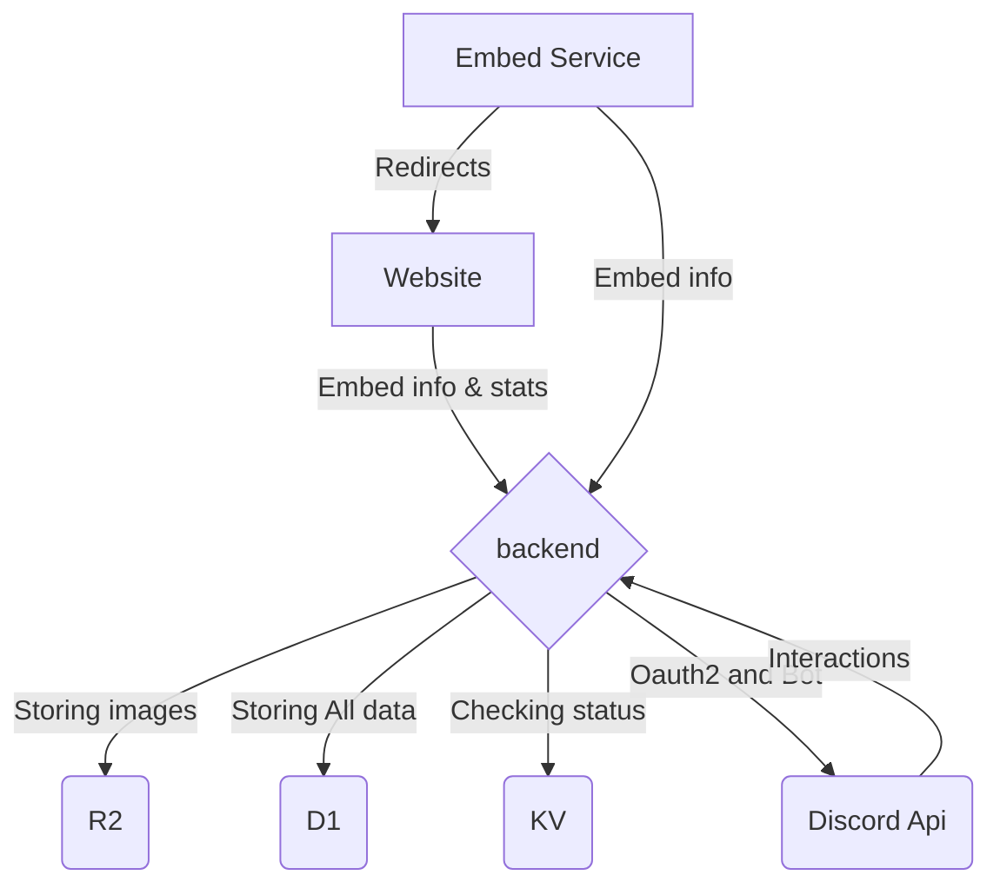

# Ascella (to the clouds)

This is Ascella but fully rewritten to work with the [Cloudflare ecosystem](https://cloudflare.com/), using workers, D1, R2 & KV.

Here is a simple flow chart:



[Discord server](https://discord.gg/BDxd9AuHpr)

## Developing

Create a env.json

```json
{
  "default": {
    "CLIENT_ID": "",
    "CLIENT_PUB": "",
    "CLIENT_SECRET": "",
    "CLIENT_TOKEN": "",
    "SENTRY_DSN": "",
    "DEBUG": false
  },
  "development": {
    "APP_URL": "http://127.0.0.1:8787",
    "DEBUG": true
  },
  "staging": {
    "APP_URL": "https://staging.ascella.host"
  },
  "production": {
    "APP_URL": "https://api.ascella.host"
  }
}
```
